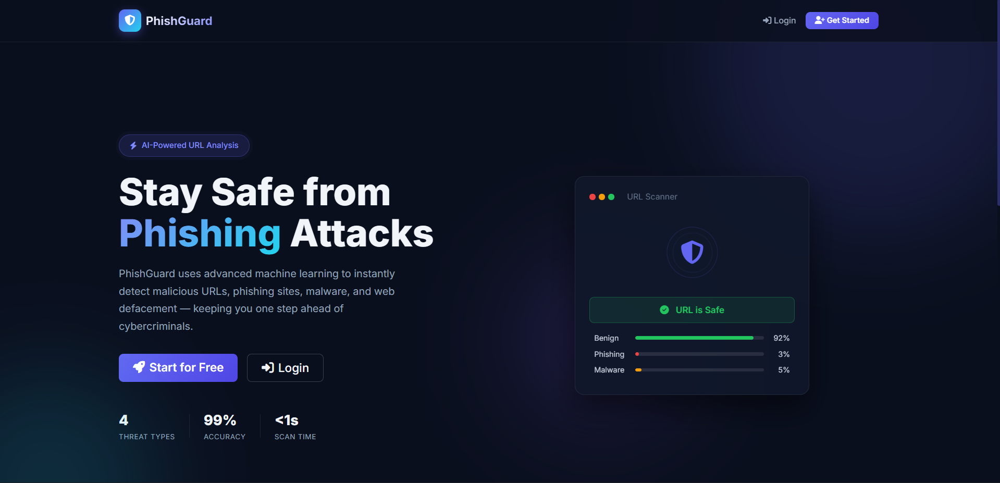
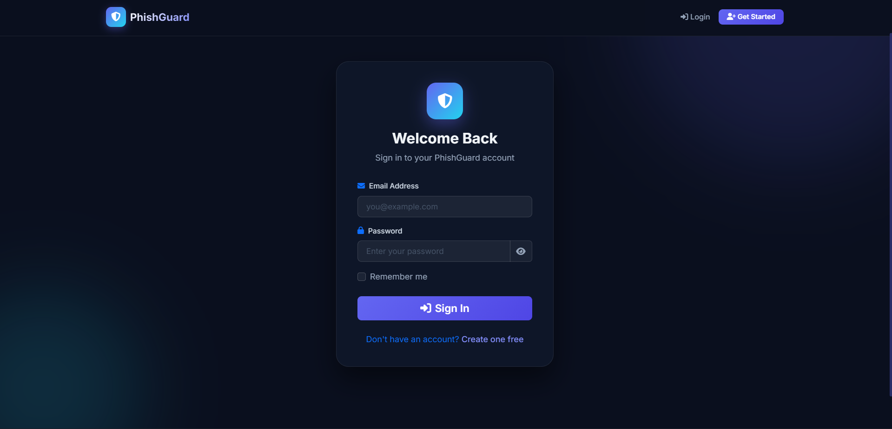
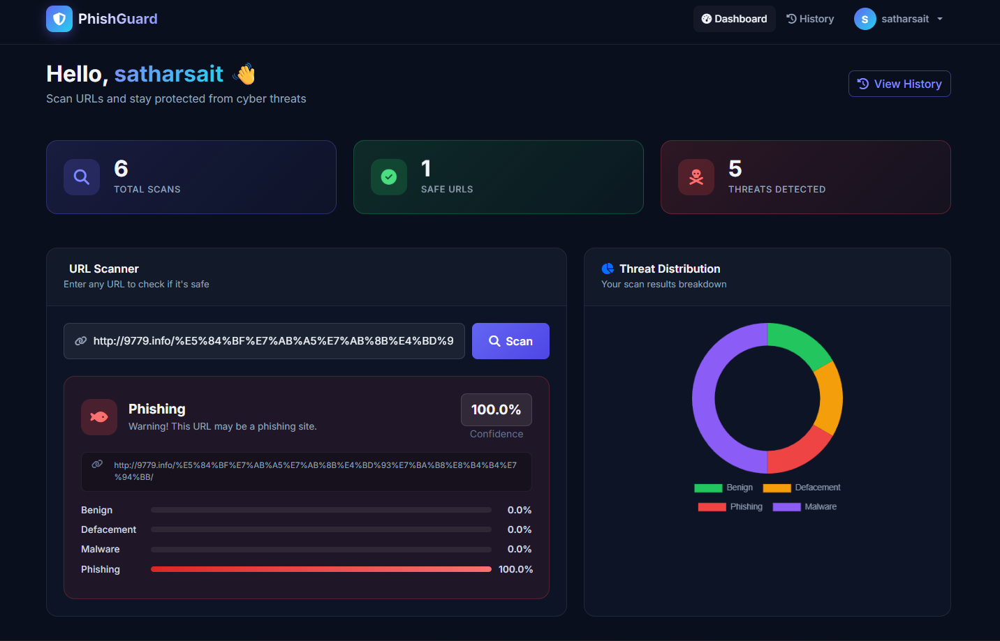
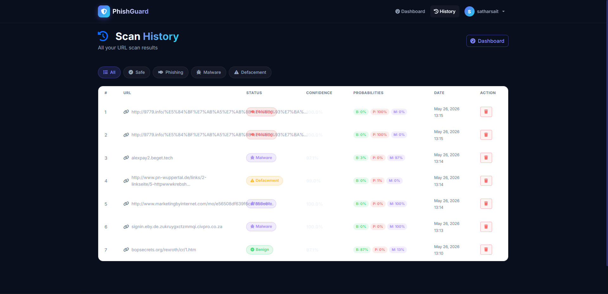

# 🛡️ AI Phishing Detection System

An AI-powered phishing detection web application developed using **Python, Flask, Machine Learning, and Cybersecurity concepts**.  
The system analyzes URLs and predicts whether they are safe, phishing, malware-related, or defacement-based threats.

---

# 🚀 Features

- 🔍 AI-powered URL scanning
- 🛡️ Phishing & malware detection
- 📊 Threat probability analysis
- 📈 Dashboard analytics
- 🕘 Scan history tracking
- 👤 User authentication system
- 🎨 Modern responsive UI
- ⚡ Real-time scan results

---

# 🛠️ Technologies Used

- Python
- Flask
- Machine Learning
- HTML
- CSS
- JavaScript
- SQLite
- Git & GitHub

---

# 📸 Screenshots

## Homepage


---

## Register Page


---

## Login Page


---

## Detection Dashboard


---

## Scan History


---

# ⚙️ Installation

## Clone Repository

```bash
git clone https://github.com/satharsait/AI-Phishing-Detection.git
```

## Navigate to Project

```bash
cd AI-Phishing-Detection
```

## Install Dependencies

```bash
pip install -r requirements.txt
```

## Run Application

```bash
python app.py
```

---

# 📌 Future Improvements

- Browser extension integration
- Real-time threat intelligence APIs
- Email phishing detection
- Admin analytics panel
- Cloud deployment
- Advanced ML model improvements

---

# 🎯 Project Purpose

This project was developed as a BCA academic project to explore:

- Cybersecurity concepts
- AI-based threat detection
- Web application security
- Practical Flask development
- Security-focused UI/UX design

---

# 👨‍💻 Author

**Sathar Sait**  
BCA Student | Aspiring Cybersecurity Professional | AI & Automation Enthusiast

GitHub: https://github.com/satharsait

---

⭐ If you like this project, consider giving it a star.
